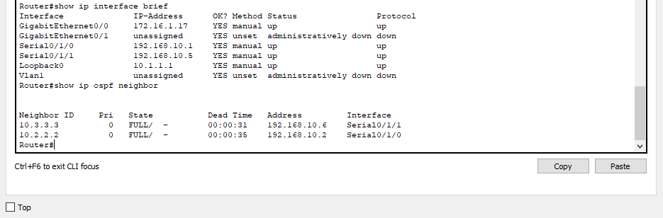
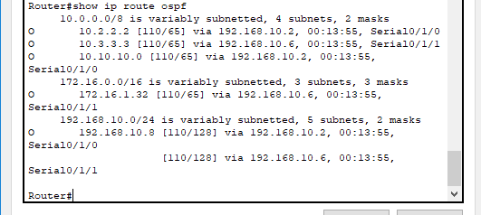
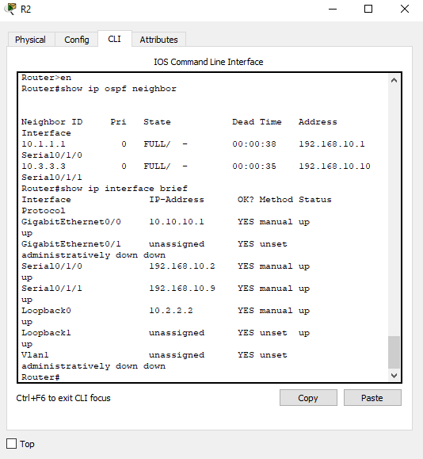
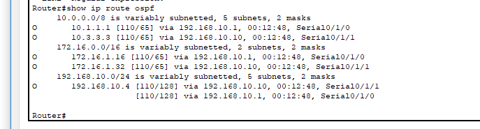
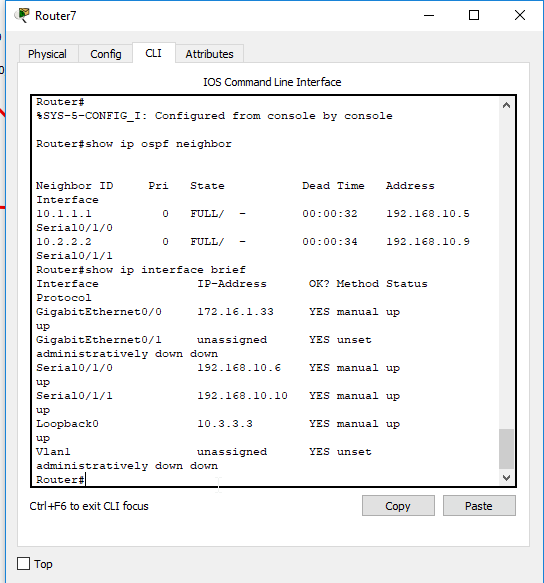
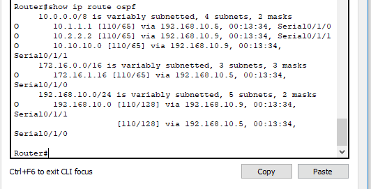

# 1 - Configurar los dispositivos

Tenemos 3 routers, R1, R2 y R3
## R1
int g0/0
ip address 172.16.1.17 255.255.255.240

int s0/1/0
ip address 192.168.10.1 255.255.255.252

int s0/1/1
ip address 192.168.10.5 255.255.255.252

int lo0
ip address 10.1.1.1 255.255.255.255

## R2
int g0/0
ip address 10.10.10.1 255.255.255.0

int s0/1/0
ip address 192.168.10.2 255.255.255.252

int s0/1/1
ip address 192.168.10.9 255.255.255.252

int lo0
ip address 10.2.2.2 255.255.255.255

## R3

int g0/0
ip address 172.16.1.33 255.255.255.248

int s0/1/0
ip address 192.168.10.6 255.255.255.252

int s0/1/1
ip address 192.168.10.10 255.255.255.252

int lo0
ip address 10.3.3.3 255.255.255.255

## PC1

int nic
ip address 172.16.1.30 255.255.255.240

## PC2

int nic
ip address 10.10.10.254 255.255.255.0

## PC3
int nic
ip address 172.16.1.38 255.255.255.248


# Implementar OSPF

OSPF (Open shortest path first) es un protocolo de routing de estado de enlace desarrollado como alternativa del protocolo de routing por vector de distancias, RIP.


## R1
router ospf 10
network 192.168.10.1 0.0.0.3 area 0
network 192.168.10.5 0.0.0.3 area 0
network 172.16.1.17 0.0.0.15 area 0
network 10.1.1.1 0.0.0.0 area 0

## R2

router ospf 10
network 10.10.10.1 0.0.0.255 area 0
network 192.168.10.2 0.0.0.3 area 0
network 192.168.10.9 0.0.0.3 area 0
network 10.2.2.2 0.0.0.0 area 0

## R3
router ospf 10
network 172.16.1.33 0.0.0.7 area 0
network 192.168.10.6 0.0.0.3 area 0
network 192.168.10.10 0.0.0.3 area 0
network 10.3.3.3 0.0.0.0 area 0

## Verificación
Para verificar, vamos a ejecutar los siguientes comandos en los 3 routers:

```
show ip route ospf
show ip ospf neighbor
show ip interface brief
```
En el router1:



En el router2:



En el router3:



